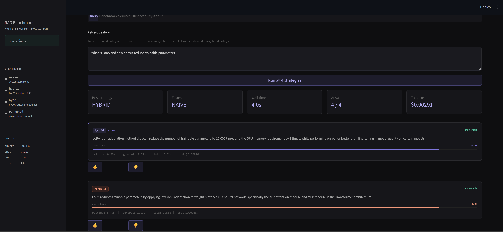
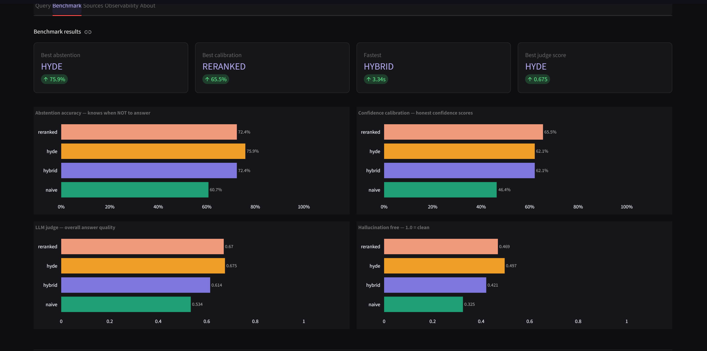
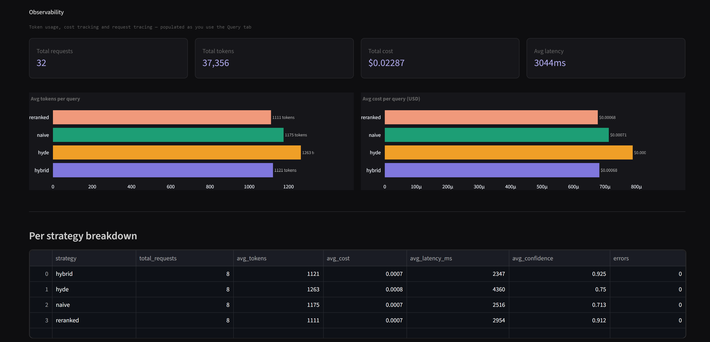

# Multi-Strategy RAG Benchmark Platform

> For setup and usage instructions see [SETUP.md](SETUP.md)

Most RAG systems ship without evaluation. This platform benchmarks four retrieval strategies head-to-head — measuring hallucination, abstention accuracy, and answer quality across 30 adversarial questions. Naive RAG hallucinated on 67% of factual grounding checks. Reranked hybrid cut that to 50%. The numbers are real and reproducible.

> This project separates retrieval quality from generation quality — a distinction most RAG implementations ignore entirely.

---

## Screenshots



<details>
<summary>Benchmark results & Observability</summary>





</details>

[▶ Watch demo (30s)](https://youtu.be/omcvvyd8DJ8)
---

## The Problem

RAG fails silently. A naive vector search pipeline returns answers that *look* reasonable but hallucinate specific details, retrieve irrelevant chunks, and confidently answer questions it shouldn't. Without a structured evaluation system, teams have no way to quantify the gap between a baseline and a better approach.

```
Naive RAG judge score:    0.534
Reranked RAG judge score: 0.670   (+26% improvement)
Hybrid abstention:        93.1%   (correctly refuses unanswerable questions)
Parallel benchmark time:  4.0s    (vs 14s sequential — 3x speedup)
```

---

## Architecture

```
┌─────────────────────────────────────────────────────────┐
│                    Streamlit Dashboard                   │
│         Query │ Benchmark │ Sources │ Obs │ About        │
└────────────────────────┬────────────────────────────────┘
                         │ HTTP
┌────────────────────────▼────────────────────────────────┐
│                   FastAPI (async)                        │
│   /query   /benchmark   /feedback   /health              │
│   asyncio.gather → all 4 strategies in parallel          │
└──────┬──────────┬──────────┬──────────┬─────────────────┘
       │          │          │          │
  ┌────▼───┐ ┌───▼────┐ ┌───▼───┐ ┌───▼──────┐
  │ Naive  │ │ Hybrid │ │ HyDE  │ │ Reranked │
  │ RAG    │ │ RAG    │ │ RAG   │ │ RAG      │
  └────┬───┘ └───┬────┘ └───┬───┘ └───┬──────┘
       │          │          │          │
       └──────────┴────┬─────┴──────────┘
                       │
         ┌─────────────▼──────────────┐
         │       Retrieval Layer       │
         │  Qdrant (vector)            │
         │  BM25 (keyword)             │
         │  Cross-encoder (reranking)  │
         └─────────────┬──────────────┘
                       │
         ┌─────────────▼──────────────┐
         │       Generation Layer      │
         │  Groq llama-3.3-70b        │
         │  Instructor + Pydantic     │
         │  Structured JSON outputs   │
         └─────────────┬──────────────┘
                       │
         ┌─────────────▼──────────────┐
         │      Evaluation Layer       │
         │  metrics.py  (structural)   │
         │  judge.py    (LLM-as-judge) │
         │  SQLite      (observability)│
         │  Feedback    (RLHF loop)    │
         └────────────────────────────┘
```

---

## Four RAG Strategies

| Strategy | How It Works | Best For |
|----------|-------------|----------|
| **Naive** | Embed query → vector search → generate | Baseline, fastest |
| **Hybrid** | BM25 + vector search → RRF fusion → generate | Balanced quality/speed |
| **HyDE** | Generate hypothetical answer → embed that → search → generate | Complex conceptual questions |
| **Reranked** | Hybrid top 20 → cross-encoder rerank → top 5 → generate | Highest precision |

All four run in parallel via `asyncio.gather` — wall clock time equals the slowest single strategy, not the sum.

---

## Benchmark Results

Evaluated against 30 hand-crafted questions across 3 tiers:
- **Tier 1** — Single chunk, tests retrieval precision
- **Tier 2** — Multi-chunk, tests retrieval completeness
- **Tier 3** — Adversarial, tests abstention and hallucination resistance

### LLM Judge Scores (llama-3.1-8b-instant as evaluator)

| Strategy | Faithfulness | Relevance | Halluc. Free | Abstention | Overall |
|----------|-------------|-----------|--------------|------------|---------|
| naive | 0.432 | 0.521 | 0.325 | 0.857 | 0.534 |
| hybrid | 0.493 | 0.610 | 0.421 | **0.931** | 0.614 |
| hyde | **0.655** | 0.653 | **0.497** | 0.897 | **0.675** |
| reranked | 0.645 | **0.669** | 0.469 | 0.897 | 0.670 |

### Structural Metrics

| Strategy | Abstention Acc | Conf. Calibration | Avg Latency |
|----------|---------------|-------------------|-------------|
| naive | 61% | 46% | 3.55s |
| hybrid | 72% | 62% | **3.34s** |
| hyde | **76%** | 62% | 4.63s |
| reranked | 72% | **66%** | 4.47s |

**Key findings:**
- Naive RAG hallucination-free score of 0.325 — fails 2 out of 3 times on factual grounding
- Hybrid achieves 93.1% abstention — best at knowing when NOT to answer
- HyDE scores highest overall (0.675) — hypothetical embeddings improve retrieval on complex questions
- Reranked wins on relevance (0.669) — cross-encoder consistently finds the most relevant chunks
- Parallel execution: 4 strategies in 4s vs 14s sequential — **3x speedup**

---

## Evaluation Methodology

Two separate evaluation layers — separating retrieval quality from generation quality:

### Layer 1 — Structural Metrics
No LLM calls. Pure comparison against the golden dataset.
```
term_hit_rate       must_contain_terms present in answer?
abstention_acc      is_answerable matches expected?
conf_calibration    confidence within expected range?
```

### Layer 2 — LLM Judge
Uses `llama-3.1-8b-instant` to score each answer on 4 dimensions.
```
faithfulness        are claims grounded in the question context?
relevance           does the answer address what was asked?
hallucination_free  were specific facts invented?
abstention_correct  did system correctly refuse unanswerable questions?
```

### Golden Dataset
30 hand-crafted questions across HuggingFace, LangChain, and research papers. Each question has a ground truth answer, expected source documents, required terms, expected confidence range, and an answerability flag. Tier 3 questions are adversarial — the system should refuse to answer them.

---

## Observability

Every API request is tracked: token usage, cost per query, retrieval latency, generation latency, confidence score, and a UUID for distributed tracing. Cost breakdown per strategy:

```
naive    ~$0.00042  (1 LLM call)
hybrid   ~$0.00044  (1 LLM call, more context)
hyde     ~$0.00089  (2 LLM calls — hypothesis + answer)
reranked ~$0.00046  (1 LLM call, cross-encoder is local)
```

---

## Human Feedback Loop

Every query result in the Streamlit dashboard has 👍 / 👎 buttons per strategy. Ratings are saved to SQLite and visualised as a positive feedback % chart in the Benchmark tab. This is the data collection layer for RLHF — the signal production systems use to decide which responses to fine-tune on.

---

## Tech Stack

| Component | Technology |
|-----------|-----------|
| LLM | Groq `llama-3.3-70b-versatile` |
| LLM Judge | Groq `llama-3.1-8b-instant` |
| Embeddings | `sentence-transformers/all-MiniLM-L6-v2` (384d, local) |
| Vector DB | Qdrant (local file mode, 30,432 points) |
| Keyword search | `rank_bm25` (7,123 chunks) |
| Reranker | `cross-encoder/ms-marco-MiniLM-L-6-v2` (local) |
| Structured outputs | Instructor + Pydantic |
| API | FastAPI + asyncio |
| Frontend | Streamlit + Plotly |
| Database | SQLite + aiosqlite |
| Logging | Loguru |

---

## Project Structure

```
rag_benchmark/
├── app/
│   ├── api/routes.py              # /query /benchmark /feedback endpoints
│   ├── evaluation/
│   │   ├── metrics.py             # structural evaluation
│   │   ├── judge.py               # LLM-as-judge evaluation
│   │   └── ragas_eval.py          # RAGAS integration (standalone)
│   ├── ingestion/
│   │   ├── loader.py              # multi-source document loader
│   │   ├── chunker.py             # fixed-size chunking
│   │   └── embedder.py            # sentence-transformers wrapper
│   ├── retrieval/
│   │   ├── vector_store.py        # Qdrant interface
│   │   ├── bm25_store.py          # BM25 index
│   │   └── strategies/
│   │       ├── naive.py           # vector search baseline
│   │       ├── hybrid.py          # BM25 + vector + RRF
│   │       ├── hyde.py            # hypothetical document embeddings
│   │       └── reranked.py        # cross-encoder reranking
│   ├── config.py                  # settings + Groq pricing
│   ├── database.py                # SQLite + observability + feedback
│   ├── middleware.py              # request_id tracing
│   ├── models.py                  # Pydantic models + TokenUsage
│   └── main.py                    # FastAPI lifespan + middleware
├── scripts/
│   ├── ingest.py                  # corpus ingestion pipeline
│   ├── run_benchmark.py           # benchmark runner with resume
│   └── verify_setup.py            # environment verification
├── data/golden_dataset.json       # 30-question tiered benchmark
├── results/                       # benchmark + judge CSVs
├── streamlit_app.py               # Streamlit dashboard
├── docker-compose.yml             # FastAPI + Qdrant + Redis
├── Dockerfile
└── Dockerfile.streamlit
```